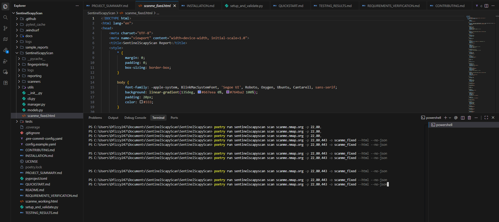
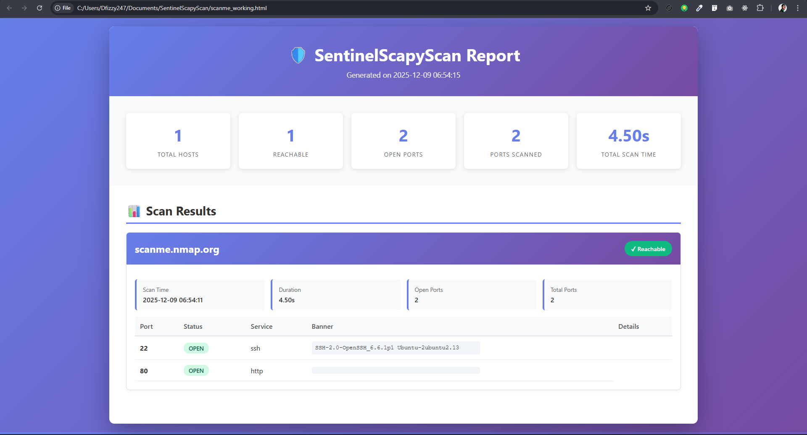

# 🛡️ SentinelScapyScan

[](https://github.com/dfizzy247/SentinelScapyScan/actions)
[](https://www.python.org/downloads/)
[](https://opensource.org/licenses/MIT)
[](https://github.com/psf/black)

A modular, production-ready cybersecurity automation suite for network scanning, service fingerprinting, and comprehensive reporting. Built with Scapy, Typer, Rich, and asyncio for high-performance network reconnaissance.

## ✨ Features

- **🔍 Network Discovery**
  - ARP scanning for local network host discovery
  - ICMP ping sweeps for reachability checks
  - CIDR range support

- **🔓 Port Scanning**
  - TCP SYN scans (stealth scanning)
  - UDP port scanning with service-specific probes
  - Customizable port ranges and lists

- **🎯 Service Fingerprinting**
  - Banner grabbing for service identification
  - HTTP/HTTPS fingerprinting with header analysis
  - TLS/SSL certificate inspection
  - Security header detection (CSP, CORS, HSTS, etc.)

- **📊 Comprehensive Reporting**
  - Beautiful HTML reports with modern UI
  - JSON output for automation and integration
  - CSV export for data analysis
  - Detailed statistics and summaries

- **⚡ Performance**
  - Asynchronous scanning capabilities
  - Concurrent fingerprinting
  - Configurable timeouts and retry logic

- **🎨 User Experience**
  - Rich CLI with progress bars and spinners
  - Color-coded output
  - Detailed logging with file rotation
  - Configurable via YAML/TOML files

## 📋 Requirements

- Python 3.8 or higher
- Root/Administrator privileges (for raw packet operations)
- WSL2/Linux environment recommended for Windows users

## 🚀 Installation

### Using Poetry (Recommended)

```bash
# Clone the repository
git clone https://github.com/dfizzy247/SentinelScapyScan.git
cd SentinelScapyScan

# Install dependencies
poetry install

# Activate virtual environment
poetry shell
```

### Using pip

```bash
# Clone the repository
git clone https://github.com/dfizzy247/SentinelScapyScan.git
cd SentinelScapyScan

# Install in development mode
pip install -e .
```

## 📖 Usage

### Basic Scanning

```bash
# Scan a single host with default ports
sudo sentinelscapyscan scan 192.168.1.1

# Scan specific ports
sudo sentinelscapyscan scan 192.168.1.1 -p 80,443,8080-8090

# Scan common ports
sudo sentinelscapyscan scan 192.168.1.1 -p common

# Scan with UDP enabled
sudo sentinelscapyscan scan 192.168.1.1 --udp

# Save results to file
sudo sentinelscapyscan scan 192.168.1.1 -o results/scan_report
```

### Advanced Options

```bash
# Disable fingerprinting for faster scans
sudo sentinelscapyscan scan 192.168.1.1 --no-fingerprint

# Skip ping check (useful for hosts that don't respond to ICMP)
sudo sentinelscapyscan scan 192.168.1.1 --skip-ping

# Custom timeout
sudo sentinelscapyscan scan 192.168.1.1 -t 5

# Generate only JSON report
sudo sentinelscapyscan scan 192.168.1.1 -o report --no-html

# Use custom configuration file
sudo sentinelscapyscan scan 192.168.1.1 -c config.yaml
```

### Service Fingerprinting

```bash
# Fingerprint HTTP service
sentinelscapyscan fingerprint example.com 80 --http

# Fingerprint HTTPS with TLS inspection
sentinelscapyscan fingerprint example.com 443 --https --tls

# Grab banner from SSH service
sentinelscapyscan fingerprint 192.168.1.1 22 --banner

# All fingerprinting methods
sentinelscapyscan fingerprint example.com 443 --all
```

### Report Generation

```bash
# Generate HTML report from JSON results
sentinelscapyscan report scan_results.json -o report.html
```

### Version Information

```bash
sentinelscapyscan version
```

## 📸 Screenshots

### Running a Scan in Terminal



*Real-time scan progress with rich terminal output showing port scanning and service fingerprinting*

### Scan Dashboard Report



*Beautiful HTML report dashboard with detailed scan results, statistics, and service information*

## 🏗️ Architecture

```
SentinelScapyScan/
│
├── SentinelScapyScan/
│   ├── cli.py              # Command-line interface
│   ├── manager.py          # Scan orchestration
│   ├── models.py           # Data models
│   │
│   ├── scanners/           # Scanning modules
│   │   ├── arp_scan.py     # ARP discovery
│   │   ├── icmp_scan.py    # ICMP probing
│   │   ├── syn_scan.py     # TCP SYN scanning
│   │   └── udp_scan.py     # UDP scanning
│   │
│   ├── fingerprinting/     # Service identification
│   │   ├── banner.py       # Banner grabbing
│   │   ├── http_fp.py      # HTTP fingerprinting
│   │   └── tls_fp.py       # TLS inspection
│   │
│   ├── reporting/          # Report generation
│   │   ├── json_writer.py  # JSON reports
│   │   ├── html_report.py  # HTML reports
│   │   └── templates/      # Jinja2 templates
│   │
│   └── utils/              # Utilities
│       ├── config.py       # Configuration management
│       └── logging.py      # Logging setup
│
└── tests/                  # Test suite
```

## 🔧 Configuration

Create a `config.yaml` file:

```yaml
scan:
  timeout: 3
  retry_count: 2
  max_concurrent_scans: 10
  enable_udp: false
  enable_fingerprinting: true
  skip_ping: false

ports:
  default_tcp_ports:
    - 21
    - 22
    - 80
    - 443
    - 3306
    - 8080

fingerprinting:
  grab_banners: true
  http_fingerprint: true
  tls_fingerprint: true
  max_concurrent_fingerprints: 10

reporting:
  output_dir: "reports"
  generate_json: true
  generate_html: true
  pretty_json: true

logging:
  level: "INFO"
  log_to_file: true
  log_file: "logs/sentinelscapyscan.log"
```

## 📊 Example Output

### Console Output

```
🛡️  SentinelScapyScan
Target: 192.168.1.1
Ports: 21 ports
Timeout: 3s
UDP Scan: Disabled
Fingerprinting: Enabled

Scanning 192.168.1.1... ━━━━━━━━━━━━━━━━━━━━━━━━━━━━━━━━━━━━━━━━ 100%

Scan Results for 192.168.1.1
Reachable: ✓ Yes

┏━━━━━━━━┳━━━━━━━━━━━━┳━━━━━━━━━━━━━━━┳━━━━━━━━━━━━━━━━━━━━━━━━━━━━━━━━━━━━━━━━━━━━━━━━━━━┓
┃ Port   ┃ Status     ┃ Service       ┃ Banner                                            ┃
┡━━━━━━━━╇━━━━━━━━━━━━╇━━━━━━━━━━━━━━━╇━━━━━━━━━━━━━━━━━━━━━━━━━━━━━━━━━━━━━━━━━━━━━━━━━━━┩
│ 22     │ OPEN       │ ssh           │ SSH-2.0-OpenSSH_8.2p1 Ubuntu-4ubuntu0.5           │
│ 80     │ OPEN       │ http          │ -                                                 │
│ 443    │ OPEN       │ https         │ -                                                 │
└────────┴────────────┴───────────────┴───────────────────────────────────────────────────┘

✓ JSON report saved to: results/scan_report.json
✓ HTML report saved to: results/scan_report.html

════════════════════════════════════════════════════════════
                    📊 SCAN SUMMARY
════════════════════════════════════════════════════════════

Total Hosts Scanned: 1
Reachable Hosts: 1
Total Open Ports: 3
Scan Duration: 12.34s
```

### HTML Report

The HTML report features:
- Modern, responsive design
- Color-coded port statuses
- Detailed service information
- Security header analysis
- TLS certificate details
- Interactive tables
- Summary statistics

## 🧪 Testing

```bash
# Run all tests
poetry run pytest

# Run with coverage
poetry run pytest --cov=SentinelScapyScan --cov-report=html

# Run specific test file
poetry run pytest tests/test_syn_scan.py

# Run with verbose output
poetry run pytest -v
```

## 🔍 Code Quality

```bash
# Format code with black
poetry run black SentinelScapyScan tests

# Lint with ruff
poetry run ruff check SentinelScapyScan tests

# Type checking with mypy
poetry run mypy SentinelScapyScan

# Run pre-commit hooks
poetry run pre-commit run --all-files
```

## 🤝 Contributing

Contributions are welcome! Please follow these steps:

1. Fork the repository
2. Create a feature branch (`git checkout -b feature/amazing-feature`)
3. Commit your changes (`git commit -m 'Add amazing feature'`)
4. Push to the branch (`git push origin feature/amazing-feature`)
5. Open a Pull Request

Please ensure:
- Code passes all tests
- Code is formatted with Black
- Code passes Ruff linting
- New features include tests
- Documentation is updated

## 📝 License

This project is licensed under the MIT License - see the [LICENSE](LICENSE) file for details.

## ⚠️ Legal Disclaimer

This tool is provided for educational and authorized security testing purposes only. Users must:

- Only scan networks and systems they own or have explicit permission to test
- Comply with all applicable laws and regulations
- Use responsibly and ethically

The authors are not responsible for misuse or damage caused by this tool.

## 🗺️ Roadmap

- [ ] Web dashboard with FastAPI
- [ ] CVE suggestion engine
- [ ] Plugin architecture for custom scanners
- [ ] Network topology mapping
- [ ] Automated vulnerability assessment
- [ ] Integration with popular security frameworks
- [ ] Docker containerization
- [ ] Distributed scanning capabilities
- [ ] Real-time scan monitoring
- [ ] Advanced evasion techniques

## 📚 Documentation

For detailed documentation, see:
- [Architecture Guide](docs/architecture.md)
- [API Reference](docs/api.md)
- [Configuration Guide](docs/configuration.md)
- [Development Guide](docs/development.md)

## 💬 Support

- 📧 Email: support@sentinelscapyscan.example
- 🐛 Issues: [GitHub Issues](https://github.com/dfizzy247/SentinelScapyScan/issues)
- 💬 Discussions: [GitHub Discussions](https://github.com/dfizzy247/SentinelScapyScan/discussions)

## 🙏 Acknowledgments

- [Scapy](https://scapy.net/) - Powerful packet manipulation library
- [Typer](https://typer.tiangolo.com/) - Modern CLI framework
- [Rich](https://rich.readthedocs.io/) - Beautiful terminal output
- [httpx](https://www.python-httpx.org/) - Modern HTTP client
- [Jinja2](https://jinja.palletsprojects.com/) - Template engine

---

Made with ❤️ by the SentinelScapyScan Team
